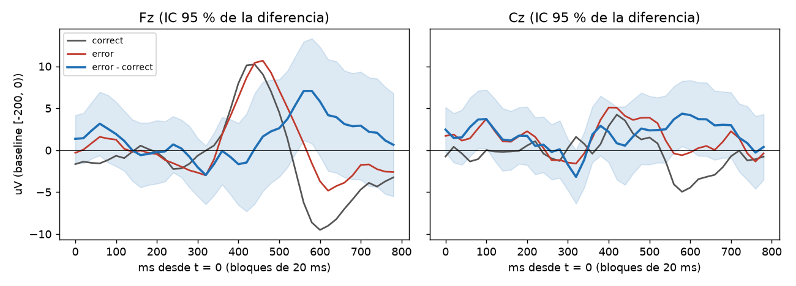

# Primer reporte C4: 20261004_223128_S01

Pipeline `intune-c4-dataset-1.0`, latency_offset_ms = 0, gate_uv = 100, gate_gyro = 30. Sujeto: S01.

## Epocas por motivo de rechazo

| motivo (primero) | correct | error | All |
|---|---|---|---|
| amplitude | 14 | 1 | 15 |
| counter | 2 | 2 | 4 |
| flags | 2 | 0 | 2 |
| gyro | 4 | 1 | 5 |
| ok | 209 | 61 | 270 |
| status | 3 | 1 | 4 |
| All | 234 | 66 | 300 |

Conteo contando todos los motivos de cada epoca (una epoca puede tener varios):

| index | epocas |
|---|---|
| amplitude | 16 |
| counter | 8 |
| gyro | 7 |
| status | 4 |
| overlap | 4 |
| flags | 2 |

Epocas limpias: 270 de 300 (90.0 %). Calibracion: 80 (norm_valid = True).

## Gran promedio error - correcto (limpias, fuera de calibracion: 61 error, 129 correct)

| canal | neg_ms | neg_uV | neg_t | pos_ms | pos_uV | pos_t |
|---|---|---|---|---|---|---|
| Fz | 320 | -2.96 | -1.7 | 540 | 5.42 | 1.8 |
| Cz | 320 | -3.18 | -2.0 | 380 | 2.91 | 1.6 |

Pico negativo buscado en 150-400 ms y positivo en 250-550 ms de la curva de diferencia; `*_t` es el t de Welch en ese punto.

## AUC (LDA de contraste, CV 5 pliegues dentro de la sesion)

- AUC = **0.458** (61 error vs 129 correct).
- Deteccion de error con 1 % de falsa alarma sobre correct: 1.6 %.
- La CV mezcla epocas de una sola sesion: es optimista y solo valida que la senal sobrevive al pipeline. Para el reporte real, split por sesion/operador (FORMAT.md).

## Lectura

Datos REALES. Prueba 11 (CLAUDE.md): pasa si la diferencia error - correct muestra una deflexion en Fz/Cz (IC 95 % que no incluye 0) y AUC > 0.6 con split por sesion.
