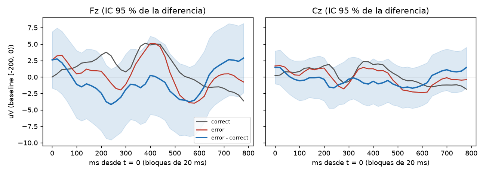

# Primer reporte C4: 20261005_000205_S02

Pipeline `intune-c4-dataset-1.0`, latency_offset_ms = 0, gate_uv = 100, gate_gyro = 30. Sujeto: S02.

## Epocas por motivo de rechazo

| motivo (primero) | correct | error | All |
|---|---|---|---|
| amplitude | 24 | 5 | 29 |
| counter | 2 | 0 | 2 |
| flags | 1 | 0 | 1 |
| gyro | 1 | 0 | 1 |
| ok | 440 | 127 | 567 |
| All | 468 | 132 | 600 |

Conteo contando todos los motivos de cada epoca (una epoca puede tener varios):

| index | epocas |
|---|---|
| amplitude | 30 |
| gyro | 2 |
| counter | 2 |
| flags | 1 |

Epocas limpias: 567 de 600 (94.5 %). Calibracion: 80 (norm_valid = True).

## Gran promedio error - correcto (limpias, fuera de calibracion: 127 error, 360 correct)

| canal | neg_ms | neg_uV | neg_t | pos_ms | pos_uV | pos_t |
|---|---|---|---|---|---|---|
| Fz | 240 | -4.18 | -1.5 | 400 | 0.25 | 0.1 |
| Cz | 240 | -1.65 | -1.0 | 320 | -0.14 | -0.1 |

Pico negativo buscado en 150-400 ms y positivo en 250-550 ms de la curva de diferencia; `*_t` es el t de Welch en ese punto.

## AUC (LDA de contraste, CV 5 pliegues dentro de la sesion)

- AUC = **0.500** (127 error vs 360 correct).
- Deteccion de error con 1 % de falsa alarma sobre correct: 2.4 %.
- La CV mezcla epocas de una sola sesion: es optimista y solo valida que la senal sobrevive al pipeline. Para el reporte real, split por sesion/operador (FORMAT.md).

## Lectura

Datos REALES. Prueba 11 (CLAUDE.md): pasa si la diferencia error - correct muestra una deflexion en Fz/Cz (IC 95 % que no incluye 0) y AUC > 0.6 con split por sesion.
