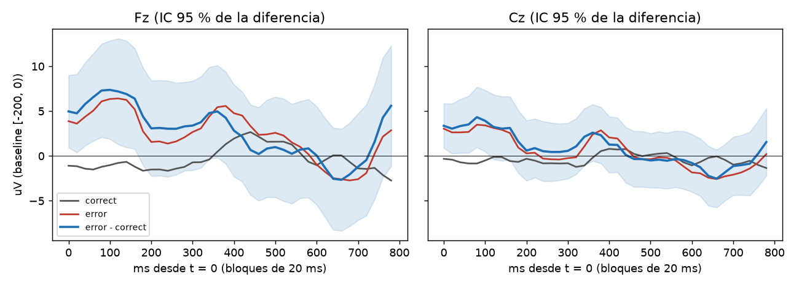

# Primer reporte C4: 20261005_015655_S03

Pipeline `intune-c4-dataset-1.0`, latency_offset_ms = 0, gate_uv = 100, gate_gyro = 30. Sujeto: S03.

## Epocas por motivo de rechazo

| motivo (primero) | correct | error | manual | All |
|---|---|---|---|---|
| amplitude | 16 | 1 | 5 | 22 |
| counter | 15 | 3 | 2 | 20 |
| flags | 4 | 4 | 2 | 10 |
| gyro | 5 | 1 | 4 | 10 |
| ok | 340 | 101 | 117 | 558 |
| status | 9 | 1 | 0 | 10 |
| All | 389 | 111 | 130 | 630 |

Conteo contando todos los motivos de cada epoca (una epoca puede tener varios):

| index | epocas |
|---|---|
| counter | 30 |
| amplitude | 23 |
| gyro | 12 |
| flags | 10 |
| status | 10 |
| overlap | 9 |

Epocas limpias: 558 de 630 (88.6 %). Calibracion: 80 (norm_valid = True).

## Gran promedio error - correcto (limpias, fuera de calibracion: 101 error, 260 correct)

| canal | neg_ms | neg_uV | neg_t | pos_ms | pos_uV | pos_t |
|---|---|---|---|---|---|---|
| Fz | 400 | 2.82 | 1.1 | 360 | 4.96 | 1.9 |
| Cz | 260 | 0.44 | 0.3 | 360 | 2.6 | 1.6 |

Pico negativo buscado en 150-400 ms y positivo en 250-550 ms de la curva de diferencia; `*_t` es el t de Welch en ese punto.

## AUC (LDA de contraste, CV 5 pliegues dentro de la sesion)

- AUC = **0.558** (101 error vs 260 correct).
- Deteccion de error con 1 % de falsa alarma sobre correct: 0.0 %.
- La CV mezcla epocas de una sola sesion: es optimista y solo valida que la senal sobrevive al pipeline. Para el reporte real, split por sesion/operador (FORMAT.md).

## Lectura

Datos REALES. Prueba 11 (CLAUDE.md): pasa si la diferencia error - correct muestra una deflexion en Fz/Cz (IC 95 % que no incluye 0) y AUC > 0.6 con split por sesion.
