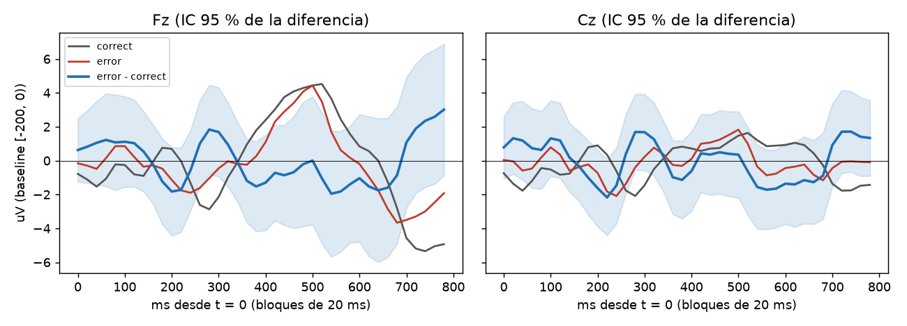

# Primer reporte C4: 20261005_081005_S04

Pipeline `intune-c4-dataset-1.0`, latency_offset_ms = 0, gate_uv = 100, gate_gyro = 30. Sujeto: S04.

## Epocas por motivo de rechazo

| motivo (primero) | correct | error | manual | All |
|---|---|---|---|---|
| gyro | 1 | 1 | 0 | 2 |
| ok | 237 | 86 | 165 | 488 |
| All | 238 | 87 | 165 | 490 |

Conteo contando todos los motivos de cada epoca (una epoca puede tener varios):

| index | epocas |
|---|---|
| gyro | 2 |

Epocas limpias: 488 de 490 (99.6 %). Calibracion: 80 (norm_valid = True).

## Gran promedio error - correcto (limpias, fuera de calibracion: 86 error, 157 correct)

| canal | neg_ms | neg_uV | neg_t | pos_ms | pos_uV | pos_t |
|---|---|---|---|---|---|---|
| Fz | 200 | -1.83 | -1.4 | 280 | 1.84 | 1.4 |
| Cz | 220 | -2.17 | -1.9 | 280 | 1.69 | 1.5 |

Pico negativo buscado en 150-400 ms y positivo en 250-550 ms de la curva de diferencia; `*_t` es el t de Welch en ese punto.

## AUC (LDA de contraste, CV 5 pliegues dentro de la sesion)

- AUC = **0.594** (86 error vs 157 correct).
- Deteccion de error con 1 % de falsa alarma sobre correct: 0.0 %.
- La CV mezcla epocas de una sola sesion: es optimista y solo valida que la senal sobrevive al pipeline. Para el reporte real, split por sesion/operador (FORMAT.md).

## Lectura

Datos REALES. Prueba 11 (CLAUDE.md): pasa si la diferencia error - correct muestra una deflexion en Fz/Cz (IC 95 % que no incluye 0) y AUC > 0.6 con split por sesion.
