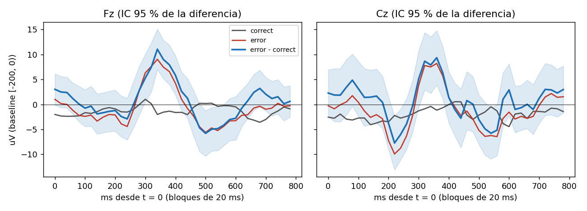

# Primer reporte C4: synth_s1

Pipeline `intune-c4-dataset-1.0`, latency_offset_ms = 0, gate_uv = 100, gate_gyro = 30. Sujeto: synthetic.

## Epocas por motivo de rechazo

| motivo (primero) | correct | error | manual | All |
|---|---|---|---|---|
| amplitude | 10 | 1 | 0 | 11 |
| flags | 5 | 2 | 0 | 7 |
| flat | 2 | 0 | 0 | 2 |
| gyro | 15 | 1 | 0 | 16 |
| ok | 193 | 63 | 0 | 256 |
| overlap | 2 | 0 | 0 | 2 |
| saturated | 1 | 0 | 0 | 1 |
| status | 4 | 1 | 2 | 7 |
| All | 232 | 68 | 2 | 302 |

Conteo contando todos los motivos de cada epoca (una epoca puede tener varios):

| index | epocas |
|---|---|
| gyro | 16 |
| amplitude | 12 |
| flags | 7 |
| status | 7 |
| overlap | 4 |
| flat | 2 |
| saturated | 1 |

Epocas limpias: 256 de 302 (84.8 %). Calibracion: 80 (norm_valid = True).

## Gran promedio error - correcto (limpias, fuera de calibracion: 63 error, 113 correct)

| canal | neg_ms | neg_uV | neg_t | pos_ms | pos_uV | pos_t |
|---|---|---|---|---|---|---|
| Fz | 240 | -2.89 | -1.4 | 340 | 11.05 | 5.3 |
| Cz | 220 | -7.72 | -2.8 | 360 | 9.35 | 3.4 |

Pico negativo buscado en 150-400 ms y positivo en 250-550 ms de la curva de diferencia; `*_t` es el t de Welch en ese punto.

## AUC (LDA de contraste, CV 5 pliegues dentro de la sesion)

- AUC = **0.694** (63 error vs 113 correct).
- Deteccion de error con 1 % de falsa alarma sobre correct: 9.5 %.
- La CV mezcla epocas de una sola sesion: es optimista y solo valida que la senal sobrevive al pipeline. Para el reporte real, split por sesion/operador (FORMAT.md).

## Lectura

Datos SINTETICOS (make_synthetic.py): el ErrP se inserto a mano. Esto prueba que el pipeline (ventana, baseline, diezmado, compuerta) lo conserva y que el reporte funciona; la prueba 11 real requiere grabaciones reales.
